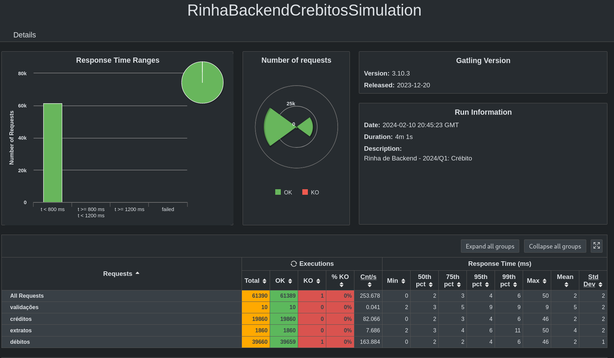

## Fiber
Uma modesta aplicação feita em Python, usando Falcon como framework web, Pony(ORM) e PostgreSQL no banco de dados. A aplicação roda utilizando o interpretador PyPy em sua versão mais recente.

### Resultados de Momento
