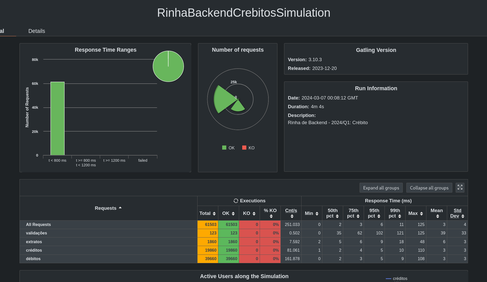
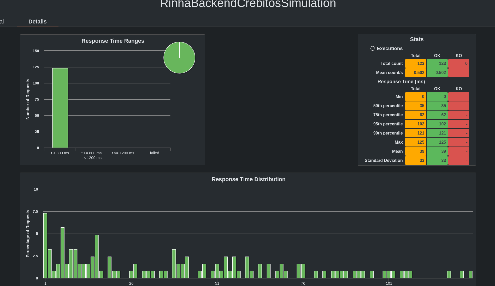

## Fiber
[Fiber](https://github.com/mvellasco/fiber) é uma aplicação modesta(mas com fibra) feita em Python :snake:, usando [Falcon](https://falconframework.org/) como framework web, [Pony ORM](https://ponyorm.org/), e o banco de dados [Postgres](https://www.postgresql.org/).

A aplicação roda utilizando o compilador JIT e interpretador [PyPy3](https://doc.pypy.org/en/latest/index.html) em sua versão mais recente(7.3.15).

### Detalhes e a Rinha de Backend
O desafio que o software se propõe a resolver, é tema da [Rinha de Backend](https://github.com/mvellasco/rinha-de-backend-2024-q1/tree/mvellasco-fiber-rinha). Em poucas palavras, a idéia da rinha é explorar um tópico específico relacionado ao backend de aplicações. Nessa edição, o problema foi *concorrência*, com múltiplas instâncias do projeto acessando um banco de dados e tendo que aplicar as regras de negócio de forma consistente.

### A proposta
Para resolver esse problema, a principal técnica utilizada é a de [isolation levels](http://en.wikipedia.org/wiki/Isolation_(database_systems)), daqui em diante, livremente traduzida para "nível(eis) de isolamento". Uma técnica de controle de concorrência¹, que consiste em definir em qual ponto de uma transação será possível enxergar as mudanças no banco de dados sendo executadas por transações concorrentes¹. O nível nível de isolamento escolhido foi o READ COMMITED, padrão do PostgreSQL, que permite uma transação visualizar as mudanças ocorridas antes dela começar. Apesar de não ser o "nível de isolamento" mais seguro, é bastante eficaz e permite maior concorrência do que o nível SERIALIZABLE(maior dos 4 níveis de isolamento) por exemplo.

Em suma, o trabalho pesado é feito no banco de dados, que implementa a técnica descrita acima deixando a API apenas com os compromissos de: validar os dados em requisições, controlar o fluxo de dados, e executar ações específicas para leitura e escrita de dados, além de processar e responder à requisições HTTP.

Notas:

¹ - O uso dos termos concorrência e concorrentes, vem de uma tradução livre do termo "concurrency", que signica simultainedade. A escolha desse termo, é para evidênciar a natureza do problema. 

### Resultados Finais
obs: a cobra vai fumar :snake: :smoking:
obs2: seja o que deus quiser, se ficar entre os 50-100 primeiros já ta bom demais.

